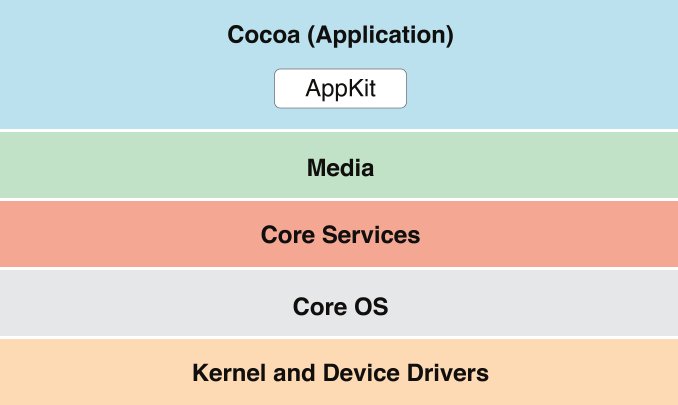

# iOS Cocoa

La capa de Cocoa, es la encargada principal del entorno gráfico de los entornos OC X, lo que incluye cosas como el centro de notificaciones, el modo pantalla completa, y el auto guardado que se implementan a través de la capa de Cocoa.

> Nota: Cocoa normalmente se refiere a la capa de la aplicación OS X, pero en otros entornos o documentación, se refiere a todo el entorno gráfico programable.

El termino Aqua hace referencia a toda la apariencia y comportamiento de OS X. El "Look and feel" de Aqua se caracteriza por ser consistente, "user-friendly", color y texturas. Mucho del "Look and feel"  de Aqua viene dado por Cocoa, así que tu puedes usar recursos dados por la propia Apple para seguir sus mejores practicas de estilo, la cual puedes encontrar aquí [_OS X Human Interface Guidelines_](https://developer.apple.com/design/human-interface-guidelines/)

A continuación te dejo una imagen que te puede ayudar a entender un poco mejor como funcionan las capas de una app iOS

Para desglosar los puntos más relevantes de cocoa, te dejare un listado para que puedas encontrar lo que más te interese, aunque te recomiendo ver todo en el orden que se lista 😁

## Caracteristicas de alto nivel

- Centro de Notificaciones
- Game Center
- Sharing
- Resume
- Modo Pantalla completa
- Cocoa Auto Layout
- Popovers
- Configuración de Software
- Accesibilidad
- AppleScript
- Spotlight
- Ink Services

## Frameworks
Sí, Cocoa cuenta con algunos frameworks dentro de si, que ayudan para que el desarrollo de las apps sea más eficiente y generé más stonks 🤑

- Cocoa Umbrella Framework
  - AppKit
  - Foundation
  - Core Data
- Game Kit
- Preferences Panes
- Screen Saver
- Security Interface
